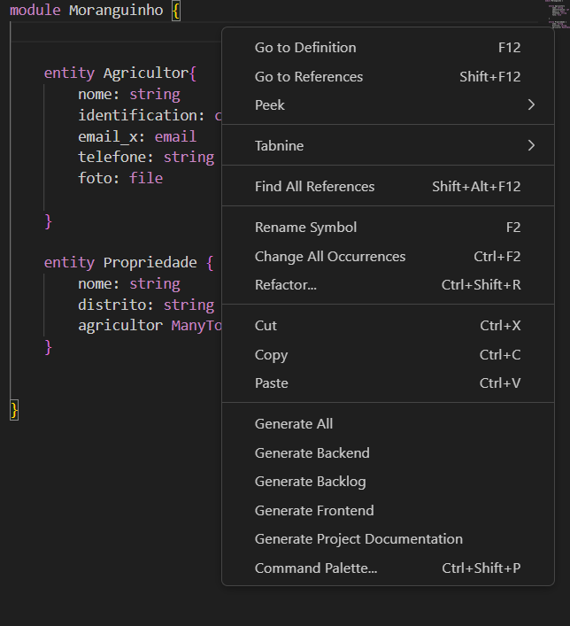

# Spark
### Gerador de código Backend, documentação e diagramas uml. Utilizando linguagem de programação própria feita em Langium, aqui explicaremos sua utilização e sintaxe.
## Instalação:

Instale a extensão pelo [Visual Studio Marketplace](https://marketplace.visualstudio.com/items?itemName=LEDSIFES.spark-leds), ou clone o repositório, crie a package da extensão, e instale.

## Utilização:

Para utilizar o Spark, crie seu arquivo `.Spark`, programe a estrutura desejada e depois clique com o botão direito e escolha o que você deseja gerar.


## Componentes da linguagem

### Configuration:
Definção das principais configurações do gerador, como linguagem de programação, nomes e descrições.

```
Configuration {
    software_name: "Nome do Software"
    about: "Descrição do Software"
    language: LANGUAGETYPE
    database_name: "nome da base de dados"
    package_path: LANGUAGETYPE
}
```
A variável LANGUAGETYPE pode ser: `python, java, csharp-minimal-api, csharp-clean-architecture`.

### Módulos:
Definição dos módulos, apenas o nome do módulo e definição de seus elementos, dentro de um módulo podemos ter outros módulos ou entidades.

``` 
module Modulo {
    elementos do módulo...
}
```
### Entidades:
Definição das entidades, seus atributos e relações.
``` 
entity Entidade {
    atributo: DATATYPE fullName: "Nome do atributo" unique
    atributo3: DATATYPE blank
    atributo4: DATATYPE max: 100 min: 1
    fun funcao () : DATATYPE
    Entidade Relation Modulo.Entidade2
}
```
Para criar entidades, elas precisam estar inseridas em módulos.  
Elementos adicionais dos atributos: `fullName, max, min, unique, blank`.  
A variável `DATATYPE` pode ser: `string, integer, decimal, datetime, date, boolean, uuid, email, brazilian_person_id, brazilian_organization_id, currency, mobilePhoneNumber, phoneNumber, file, void`.  
A variável Relation pode ser: `OneToOne, OneToMany, ManyToOne, ManyToMany`, Quando `ManyToMany` podemos usar o elemento `by`para indiciar a entidade associativa da relação, dessa forma: `Entidade ManyToMany Modulo.entidade2 by Modulo.Entidade3`.
### Casos de Uso:
Definição dos casos de uso, com seu nome, atributos, atores, entidade e dependências.
```
usecase CasoDeUso {
    fullname: "Nome do caso de uso"
    kind: kind

    performed: Ator
    entities: Modulo.Entidade
    extend CasoDeUso2
    include CasoDeUso3
}
```
A variável `kind` pode ser: `manage, view`.  

### Atores
Definição de atores:
```
actor ator is Modulo.Entidade
```


## Exemplos do funcionamento

```
Configuration {
    software_name: "Morango"
    about: "Moranguinho!"
    language: python
}

module Moranguinho {

    
    entity Agricultor{
        nome: string
        identification: cpf
        email_x: email
        telefone: string
        foto: file

    }

    entity Propriedade {
        nome: string
        distrito: string
        agricultor ManyToOne Agricultor
    }
    
    
}
```


## O que é gerado?

### Docs:

- README do projeto com os pacotes
- Diagrama de pacotes
- README do projeto com as classes
- Diagrama de classes

### Backend:

- DockerFile e compose
Arquivos que definem a configuração e a criação de containers Docker para o projeto.
- gitlab-ci
Arquivos de configuração do GitLab CI/CD, automatizando tarefas como testes, builds e deployments.
- Swagger
Documentação da API REST do projeto no formato Swagger, facilitando a integração com outras aplicações e ferramentas.


#### Python:

  - Requirements
  Um arquivo listando todas as dependências Python necessárias para executar o projeto, facilitando a instalação.
  - Django
  Código do backend, utilizando o framework Django, com pastas para testes, o migration para a estruturação do banco e com uma API REST.
  - Sonar Project
  Arquivo de configuração para a análise de código estático do projeto utilizando a ferramenta SonarQube.

 #### Java

  - GraphQL
  Implementação da API GraphQL para o projeto, fornecendo uma interface de consulta de dados flexível e eficiente.
  - Debezium
Ferramenta para captura de mudanças em bancos de dados relacionais e propagação dessas alterações para outros sistemas.
  - WebService
  Implementação de serviços web RESTful em Java.

## Documentação adicional

 - [Documentação Langium](https://langium.org/docs/introduction/)
 - [Vídeo Aulas](https://www.youtube.com/watch?v=YdulTVCNB0E&list=PLmmNK7CRoSWuUejGnfoY5_w7C-AbNU-mk)


